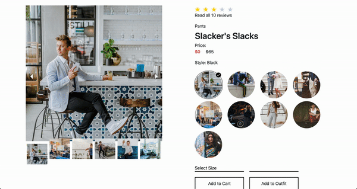

<!-- prettier-ignore-start -->

# Customer-Facing E-Com Product Page

#### What:

A greenfield redesign of the front end of product pages on a clothing brand's website.

#### Why:

Optimize for a modern, sleek, and high-performing user experience.

#### Technologies:

- Front end: React and Redux.
- Performance optimization: GZip compression, the Webpack Mini CSS Extract plugin
- Deployment: Docker Container running on an AWS EC2 server.
- Project management: Agile workflow, Trello

#### Division of labor:

- Harry Shapiro: Overview module, Redux architecture, CSS guidance, performance optimization, interaction tracking
- Luke Barr: Ratings & Reviews module, continuous integration testing
- John Otwell: Recommended & Outfit module, testing framework, deployment, Redux optimization
- Nick Moyseos: Questions & Answers module

#### Performance:

- 0.6s to first contentful paint
- 0.6s to first meaningful paint
- 1s to interactive

## Table of contents:

- [Overview](#Overview)
- [Ratings and Reviews](#R_R)
- [Questions and Answers](#QnA)
- [Recommended and Outfit](#Recommended_Outfit)
- [Filesystem](#Filesystem)
- [Deployment](#Deployment)

## Overview:

The overview module provides an attractive UX that inspires interest, and an intuitive UI to make conversion seamless.

- With the exception of the social share buttons, all code was written in-house
- Special attention was paid to the carousel, which supports several navigation styles and zooming in/out

## Questions And Answers:

The questions and answers module extends the ability to view and search questions, ask questions, answer questions and provide feedback on questions about the current product.

- All code for this component was written in-house as well, with the exception of the "add question", and "add answer" pop-up modal.

#### Filesystem

All client code is in the **src** directory, where we decided to split the work in four subdirectories, **actions**, **reducers** and **containers** for the Redux part, and **components** for React, to separate concerns.
We agreed that it would be best to keep the Redux _store_ and React _index_ files in the root src directory.
The **components**, and **containers** are split even farther with a directory for each separate widget.
We decided to structure our widget components individually, with the consensus that each widget would have it's own CSS file.
Some decided to break it event farther, into a directory for each individual component of their widget.

This structure allows for easy efficient navigation between files, and avoidance of conflicts.

    /src
      |--actions
      | |--actionName.js
      |--components
      | |--widgetName
      | | |--componentName
      | | |  |--componentName.jsx
      | | |  |--componentName.css
      | |--reducers
      | |  |--reducerName.js
      | |--containers
      | |  |--containerName.js
